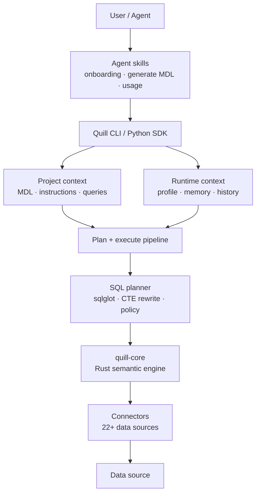
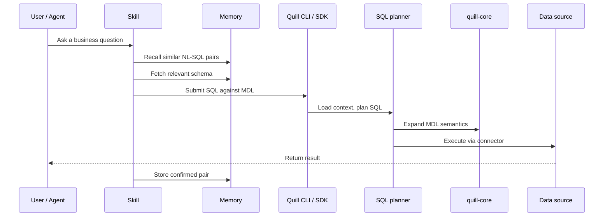

# Architecture

Quill is built as an open context layer for agents. Architecturally, that means two things:

1. Business meaning is stored in explicit project artifacts: MDL, instructions, profiles, and memory.
2. Correctness is handled as a system of primitives the agent can orchestrate, not as one hidden feature.

The result is a stack where agents can generate governed BI, from a SQL answer to a deployed GenBI dashboard, through governed business context, while Quill handles modeling, planning, validation, execution, and recall.

## Correctness is a system

Text-to-SQL does not become reliable because one metadata field is present or one prompt is clever. It becomes reliable when several pieces work together.

| Pillar | What it means | Where it lives in Quill |
| --- | --- | --- |
| **Schema linking** | Knowing which models, columns, and relationships matter for a question. | MDL + memory retrieval (`quill memory fetch`) |
| **Value profiling** | Knowing what values actually appear in the data, such as what `status = 4` means. | Connector behavior, profiling workflows, instructions indexed into memory |
| **Ambiguity detection** | Knowing when the question is underspecified and needs clarification. | Skill orchestration by the agent |
| **Generation trace** | Showing how an answer was constructed: models, joins, CTEs, and expanded SQL. | `quill dry-plan` |
| **Retry and repair** | Recovering when generated SQL fails or points at the wrong modeled object. | Structured errors, `quill dry-run`, agent retry workflows |
| **Eval** | Detecting regressions when schemas, definitions, or prompts change. | Golden NL-SQL eval workflows in development |

Quill exposes these as primitives. The agent chooses when to fetch, recall, dry-plan, execute, repair, or ask a clarification. The trace stays visible where the agent's reasoning happens.

## System overview

At a high level, Quill has four layers:

| Layer | Responsibility |
| --- | --- |
| **Agent workflow** | Skills guide the agent through onboarding, MDL generation, querying, validation, and memory updates. |
| **Project context** | MDL, instructions, profiles, and memory describe what the data means and how it should be used. |
| **Planning engine** | Quill expands modeled SQL into executable SQL using the semantic engine and SQL planner. |
| **Execution layer** | Connectors run the planned SQL against the target data source and return results. |



The same architecture can also be read as a query path:



## Core components

### Agent skills

[Skills](/oss/reference/skills) are Markdown workflows that tell AI coding agents how to operate Quill safely. They encode procedures such as "build MDL before querying," "fetch context before writing SQL," and "store confirmed examples after success."

Skills sit above the CLI. They do not hide the primitives; they help the agent use them in the right order.

### Quill CLI

The CLI is the main interface for agents and developers. It discovers the project, resolves the active profile, and routes commands to the right subsystem.

| Command | What it does |
| --- | --- |
| `quill query` / `quill --sql` | Plan and execute SQL, then return results. |
| `quill dry-plan` | Plan SQL and show the expanded SQL without executing it. |
| `quill dry-run` | Validate SQL against the live database without returning rows. |
| `quill context` | Initialize, validate, build, and inspect a Quill project. |
| `quill profile` | Manage database connection profiles. |
| `quill memory` | Index context, fetch schema items, recall examples, and store confirmed queries. |
| `quill utils` | Run helper operations such as type normalization. |

### Project context

A Quill project is the portable context package for one business data layer.

It includes:

- **MDL source files** - models, relationships, views, cubes, and project metadata.
- **`knowledge/`** - business rules (`rules/`) and confirmed NL→SQL pairs (`sql/`), the source of truth for memory.
- **`target/mdl.json`** - compiled MDL manifest used by the engine.
- **`.quill/memory/`** - derived, optional LanceDB index rebuilt from `knowledge/` for semantic retrieval.

Connection profiles live separately in `~/.quill/profiles.yml` so credentials stay environment-specific.

See the [MDL schema reference](/oss/reference/mdl) for the full project structure.

### Quill Python SDK

The `quill` Python package exposes the same plan-and-execute pipeline that the CLI drives. The CLI is a thin Typer wrapper over the SDK. Both share the orchestration code, and both can be embedded in agent frameworks, notebooks, and applications.

When invoked (via CLI or SDK), the orchestrator:

1. Receives modeled SQL.
2. Loads the compiled MDL manifest and active connection profile.
3. Calls the SQL planning subsystem (sqlglot + CTE rewrite + quill-core).
4. Sends planned SQL to the correct connector.
5. Returns results as a PyArrow table.

For higher-level integrations, see the [LangChain SDK](/oss/sdk/langchain) and [Pydantic AI SDK](/oss/sdk/pydantic). Both wrap this pipeline as agent tools.

### SQL planning

The SQL planner transforms SQL written against modeled objects into SQL that the target database can execute.

Three pieces collaborate:

- **sqlglot** parses SQL, qualifies table and column references, and transpiles between SQL dialects.
- **CTE rewriter** identifies referenced MDL objects and injects expanded model SQL as CTEs.
- **quill-core** expands MDL semantics: models, relationships, calculated fields, and views.

```text
User SQL against MDL
  |
  |-- parse and qualify SQL
  |-- identify referenced models/views
  |-- extract the relevant MDL manifest slice
  |-- expand models and calculated fields through quill-core
  |-- inject expanded CTEs
  |-- run policy checks
  |-- transpile to the target dialect
  |
  v
Executable SQL for the connected data source
```

### quill-core

`quill-core` is the Rust semantic engine. It is exposed to Python through PyO3 bindings and acts as the source of truth for MDL semantics.

It handles:

- maintaining MDL state in a session context
- extracting only the manifest objects needed for a query
- expanding `table_reference` and `ref_sql` models
- resolving calculated fields
- expanding relationship-aware expressions
- enforcing how modeled objects map to SQL

### Connectors

Connectors execute planned SQL against the target database. Each connector implements a common interface for query execution, dry-run validation, type handling, and connection lifecycle.

Supported data sources include PostgreSQL, MySQL, BigQuery, Snowflake, DuckDB, ClickHouse, Trino, SQL Server, Databricks, Redshift, Oracle, Athena, Apache Spark, and more.

### Memory layer

The [memory system](/oss/concepts/memory_system) is a LanceDB-backed retrieval layer with two primary collections:

| Collection | Contents | Purpose |
| --- | --- | --- |
| `schema_items` | Models, columns, relationships, views, cubes, and instructions | Retrieve the right context for each question. |
| `query_history` | Confirmed natural-language-to-SQL pairs | Recall examples that worked before. |

Memory turns usage into behavioral context. Each confirmed query can become a future example.

## Data flows

### Query execution

```text
quill --sql "SELECT customer_id, SUM(total) FROM orders GROUP BY 1"
  |
  |-- 1. Discover project: quill_project.yml -> target/mdl.json
  |-- 2. Resolve profile: ~/.quill/profiles.yml
  |-- 3. Plan: parse -> extract MDL -> expand CTEs -> transpile
  |-- 4. Execute: connector -> database -> PyArrow table
  |-- 5. Output: table, CSV, JSON, or SDK return value
```

### Agent-assisted query

```text
User asks a business question
  |
  |-- skill selects the query workflow
  |-- memory recalls similar accepted NL-SQL pairs
  |-- memory fetches relevant schema and instructions
  |-- agent writes SQL against MDL objects
  |-- Quill dry-plans, validates, or executes
  |-- agent repairs or asks a clarification if needed
  |-- confirmed answer is stored back into memory
```

### Project build

```text
quill context build
  |
  |-- read quill_project.yml
  |-- read models, views, cubes, and relationships
  |-- validate structure and references
  |-- compile source YAML into target/mdl.json
```

### Memory lifecycle

```text
quill memory index           -> parse MDL and instructions, build schema_items
quill memory fetch -q "..."  -> retrieve relevant schema context
quill memory recall -q "..." -> retrieve similar confirmed examples
quill memory store           -> append a new NL-SQL pair to query_history
```

## Key dependencies

| Dependency | Role |
| --- | --- |
| `quill-core-py` | Python bindings for the Rust semantic engine. |
| `sqlglot` | SQL parsing, qualification, and dialect transpilation. |
| Database connectors | Execution layer for supported data sources. |
| `pyarrow` | Query result representation. |
| `lancedb` | Vector storage for memory. |
| `sentence-transformers` | Local embeddings for memory search. |
| `typer` | CLI framework. |
| `pydantic` | Configuration and connection validation. |

## In short

Quill architecture separates context from execution:

- project files define what the data means
- memory retrieves relevant context and examples
- skills tell agents how to operate safely
- the planner and Rust engine turn modeled SQL into executable SQL
- connectors run that SQL against the database

That separation is what makes Quill portable, inspectable, and agent-native.
